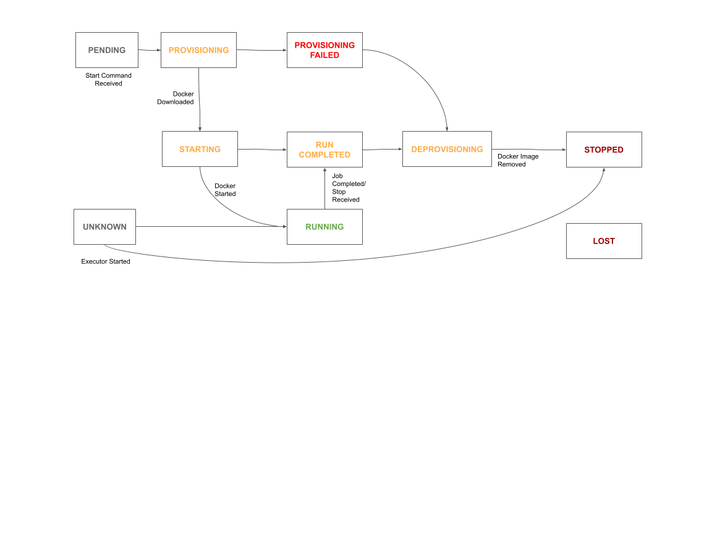

# Introduction
A **task** is a representation for transient containerized workloads on the cluster. A task instance is _supposed_ to have a much shorter life-time than an application instance. Use tasks to spin up things like automation scripts etc.

## Primary differences with an application

Please note the following important differences between a task instance and application instances

* Tasks **cannot expose ports** and virtual hosts for incoming traffic
* There are **no** readiness checks, health checks or shutdown hooks for a task
* Task instances **cannot be scaled** up or down
* Tasks cannot be **restarted**
* A task is typically **owned** by an application running on the cluster.
* Task instances are **not replaced** if the corresponding executor node goes down during execution
* Unlike applications there is no task + task instance, the only representation of task on a Drove cluster is a task instance.

!!!tip
    Use [**epoch**](https://github.com/PhonePe/epoch) to spin up tasks in a periodic manner

A **task specification** contains the following sections:

- **Source App Name** - Name of the application that created this task
- **Task ID** - User supplied task ID unique in the same `sourceAppName` scope
- **Executable** - The container to deploy on the cluster
- **Resources** - CPU and Memory required for the container
- **Placement Policy** - How containers are to be placed in the cluster
- **Environment Variables** - Environment variables and values
- **Volumes** - Volumes to be mounted into the container
- **Configs** - Configs/files to be mounted into the container
- **Logging details** - Logging spec (for example rsyslog server)
- **Tags** - A map of strings for additional metadata

## Task ID
Identification of a task is a bit more complicated on Drove. There is a **Task ID** (`{sourceAppName}-{taskId}`) which is used internally in drove. This is returned to the client when task is created.

However, clients are supposed to use the `{sourceAppName,taskId}` combo they have sent in the task spec to address and send commands to their tasks.

## Task States and operations
Tasks on Drove have their own life cycle modelled as a state machine. State transitions can be triggered by issuing operations using the APIs.

### States
Tasks on a Drove cluster can be one of the following states:

- **PENDING** - Task has been submitted, yet to be provisioned
- **PROVISIONING** - Task is assigned to an executor and docker image i ng -ownloaded
- **PROVISIONING_FAILED** - Docker image download failed
- **STARTING** - Docker run is starting
- **RUNNING** - Task is running currently
- **RUN_COMPLETED** - Task run has completed. Whether passed or failed n -o be checked from the task result.
- **DEPROVISIONING** - Docker image cleanup underway
- **STOPPED** - Task cleanup completed. This is a terminal state.
- **LOST** - Task disappeared while executor was down.
- **UNKNOWN** - All tasks that are running are put in this state when executor has been restarted and startup recovery has not kicked in yet

### Operations
The following task operations are recognized by Drove:

- **CREATE** - Create a task. The Task definition/spec is provided as an argument to this.
- **KILL** - Kill a task. The task ID is taken as a parameter.

!!!tip
    All operations need Cluster Operation Spec which can be used to control the timeout and parallelism of tasks generated by the operation.

### Task State Machine

The following state machine signifies the states and transitions as affected by cluster state and operations issued.

